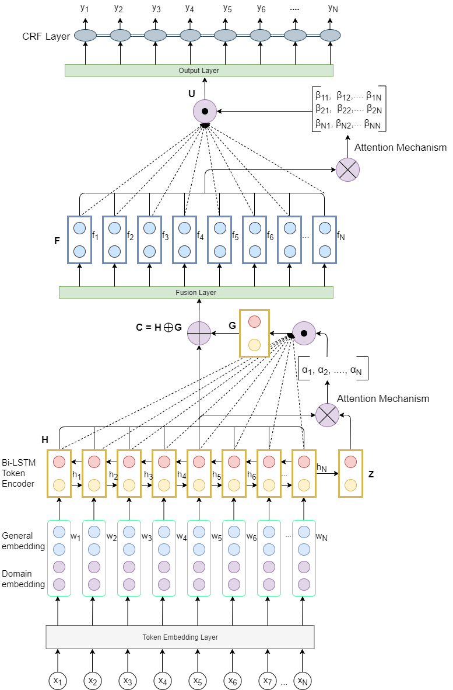
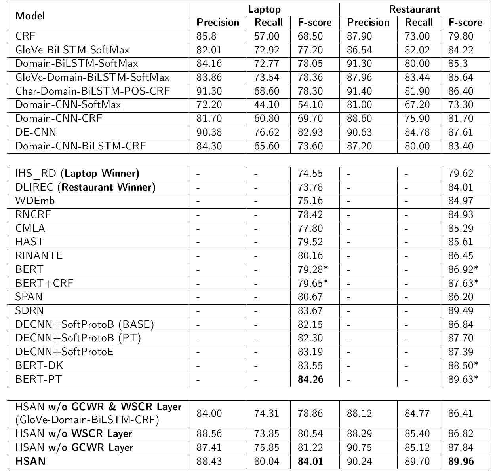

# Supervised Aspect Term extraction
This project contains the code for reproduce experiments conducted in Aspect Term Extraction for Opinion Mining Using a Hierarchical Self-Attention Network.
Note: the experiments conducted with BERT-based models were performed using the code linked with the corresponding papers.

## Prerequisites
1. For experiments implemented in PyTorch:
    * pytorch, spacy, numpy, [pytorch-crf](https://github.com/kmkurn/pytorch-crf)
2. For experiments implemented in Tensorflow:
    * nltk, tensorflow, numpy, stanford-corenlp, [pycrfsuite](https://github.com/scrapinghub/python-crfsuite)
3. Download and unzip Domain Embeddings. [Link](https://drive.google.com/file/d/12Pj5LkKnE_XQKIRABiviqgspA5DB1Zfn/view)  

## Experiments conduced: 
#### In Tensorflow directory:
1. LSTM/Bi-LSTM
2. Jordan RNN/ Bi-Jordan RNN
3. GRU/Bi-GRU
4. Additional BI-RNN (any of the above 3) for character embeddings
5. CNN
6. A stacked model of any of the above RNN with the above CNN
7. Softmax/CRF for final prediction
8. Dense layer/ANN for decoding
9. Incorporation of POS Tags
  
#### In PyTorch directory:
1. LSTM/Bi-LSTM
2. GRU/Bi-GRU
3. CRF for Decoding
4. Incorporation of Part Of Speech Tags
5. BiLSTM + Global Context Generation
6. BiLSTM + Word Context Generation
7. HSAN
8. DE-CNN [Xu et.al.](https://www.aclweb.org/anthology/P18-2094/)

## How to run experiments
Consult the README files present within each directory.

## Results

## Authors
* **Vamshi Aruru** - *Initial work* - [vamshiaruru](https://github.com/vamshiaruru)
* **V Aditya Srikanth** - *Till HSAN* - [aditya-srikanth](https://github.com/aditya-srikanth)

## Acknowledgments
* special thanks to **guillaumegenthial** for his awesome tutorial on Bi-LSTM and NER which can be read [here](https://guillaumegenthial.github.io/sequence-tagging-with-tensorflow.html)